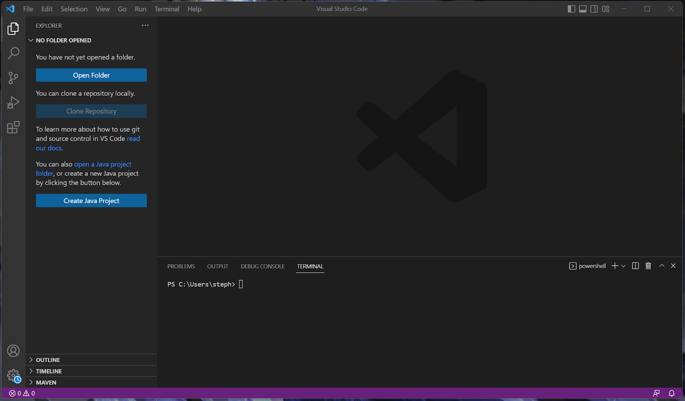

#How To Log Into Course-Specific Account on ieng6
----
##Installing VSCode

Click on this link to go to the Visual Studio Code website: 
[Link](https://code.visualstudio.com/)

Follow the instructions and make sure you are downloading the right 
version for your device, like OSX (for Mac) or Windows (for PC).

When you open up Visual Studio Code, it should look something like this.

Do not worry if some things look different such as the color or different tabs.
In this picture, I have the terminal opened up so it might look slighty
different. 

##Remotely Connecting

You might wonder: Why do we need to do this? Well many jobs and instituions use
course-specific accounts. It is more accessible which allows you to connect to 
a remote computer over the Internet to do work there. 

The first step to remotely connect on Windows is to install `git` for Windows: 
[Link](https://gitforwindows.org/)

After that you need to follow this post to properly set up your default terminal 
to use `git bash` in Visual Studio Code:
[Link](https://gitforwindows.org/](https://stackoverflow.com/questions/42606837/how-do-i-use-bash-on-windows-from-the-visual-studio-code-integrated-terminal/50527994#50527994)
