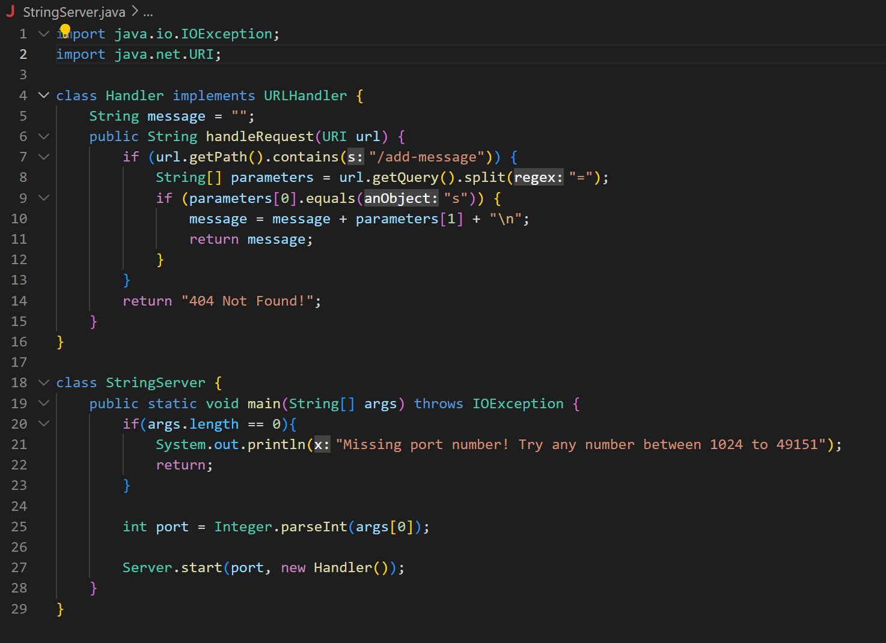
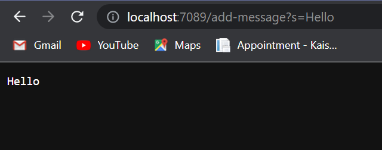
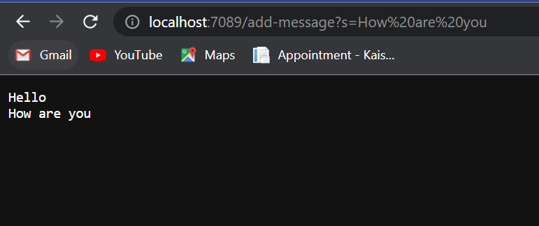

# Creating StringServer webpage

## Part 1

This is my code for my web server called StringServer. I created this with Visual Studio Code
and followed about the same format as our lab from Week 2 where we tried creating our own
server and added numbers to it. This server however differs in that it keeps track of a single
string that gets added by incoming requests. 

We needed to add `\n` after each string message in order concatenate to a new line for
any additional strings that come after.

Following the assignment directions, I first inputted `Hello` after the request 
`/add-message?s=<string>`. 

We used programs that take an URL as input and respond with the text of webpage. The part of program that
does the processing is a `URLHandler`. Our class, `StringServer`, takes `URLHandler` and starts up a 
server that listen for incoming connections.

For our server to print out `Hello` it first creates an empty String. Then it goes into handleRequest which
takes in the URL and starts processing our arguments. The methods that our code calls are 

* `getPath()`
* `contains()`
* `getQuery()`
* `split()`
* `equals()`

`getPath()` does not take in any argument but returns the path of the given file object which is in this case, 
the url. `contains()` checks whether a string contains a sequence of characters so in this case we want to check
the requests that are coming in which is in the format `/add-message?s=<string>`. `getQuery()` is part of the URI
class and returns gets query segment of URL object. In this case, we don't want the entire String so we separate 
it using `split()` which separates the String between the `=`. This is placed inside an array called `parameters`.
The first argument is always going to be `s` so we use `equals()` to assert that is true. The second parameter is 
always going to be the String we want to add so we will add that to the empty message followed by `\n` so the next
String we add will always be in a new line. 

The values change from this specific request by inputting different things such as `123` or `abc`. However, it will
always operate the same so in a way it is not changing because we keep adding the String objects into this object
called `message`. Even if we add numbers such as `123` or have something like `abc` it will interpret the second
parameter as a String and keep showing the old messages that we have added along with the new message after.

After, I inputted `How are you` after the request `/add-message?s=<string>`. 

All the same methods are called again in this case and the arguments in our code calls are the same. The only thing that changes 
is the second argument after interpretting the query and separating them into two arguments. Again the first argument is always 
the same and equal to `s` but this time the second argument is `How are you` which gets added to the String object and printed 
in a new line after `Hello`.

## Part 2

