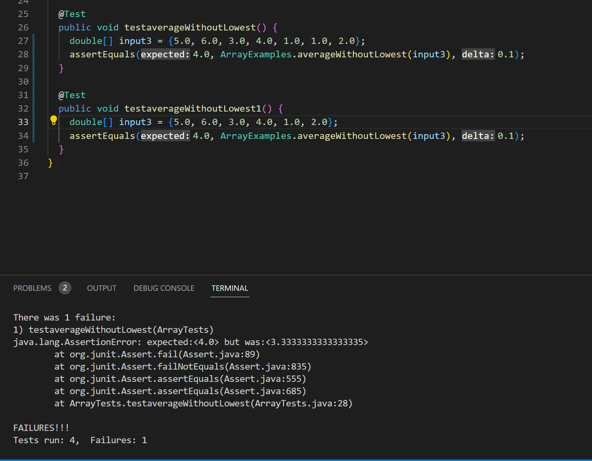

# Creating StringServer webpage

## Part 1

This is my code for my web server called StringServer. I created this with Visual Studio Code
and followed about the same format as our lab from Week 2 where we tried creating our own
server and added numbers to it. This server however differs in that it keeps track of a single
string that gets added by incoming requests. 

We needed to add `\n` after each string message in order concatenate to a new line for
any additional strings that come after.


Following the assignment directions, I first inputted `Hello` after the request 
`/add-message?s=<string>`. 


We used programs that take an URL as input and respond with the text of webpage. The part of program that
does the processing is a `URLHandler`. Our class, `StringServer`, takes `URLHandler` and starts up a 
server that listen for incoming connections.

For our server to print out `Hello` it first creates an empty String. Then it goes into handleRequest which
takes in the URL and starts processing our arguments. The methods that our code calls are 

* `getPath()`
* `contains()`
* `getQuery()`
* `split()`
* `equals()`

`getPath()` does not take in any argument but returns the path of the given file object which is in this case, 
the url. `contains()` checks whether a string contains a sequence of characters so in this case we want to check
the requests that are coming in which is in the format `/add-message?s=<string>`. `getQuery()` is part of the URI
class and returns gets query segment of URL object. In this case, we don't want the entire String so we separate 
it using `split()` which separates the String between the `=`. This is placed inside an array called `parameters`.
The first argument is always going to be `s` so we use `equals()` to assert that is true. The second parameter is 
always going to be the String we want to add so we will add that to the empty message followed by `\n` so the next
String we add will always be in a new line. 

The values change from this specific request by inputting different things such as `123` or `abc`. However, it will
always operate the same so in a way it is not changing because we keep adding the String objects into this object
called `message`. Even if we add numbers such as `123` or have something like `abc` it will interpret the second
parameter as a String and keep showing the old messages that we have added along with the new message after.

After, I inputted `How are you` after the request `/add-message?s=<string>`. 


All the same methods are called again in this case and the arguments in our code calls are the same. The only thing that changes 
is the second argument after interpretting the query and separating them into two arguments. Again the first argument is always 
the same and equal to `s` but this time the second argument is `How are you` which gets added to the String object and printed 
in a new line after `Hello`.

## Part 2

One of the bugs we encountered in lab 3 was a method called `averageWithoutLowest` in the ArrayExamples class. The method averages 
the number in the array but leaves out the lowest number when calculating. It returns 0 if there are no elements or just 1 element
in the array. However, a faliure-inducing input was discovered as if you put multiple lowest number values, it will not correctly
calculate the average. It only divides the sum of all elements in the array by the length of array - 1 which does not work if you 
remove more than one number from the array. 

This is an example of one of the failure-inducing inputs:

```
@Test
public void testaverageWithoutLowest() {
  double[] input3 = {5.0, 6.0, 3.0, 4.0, 1.0, 1.0, 2.0};
  assertEquals(4.0, ArrayExamples.averageWithoutLowest(input3), 0.1);
}
```

The expected output is 4.0 in this case. However, because of the format of the code, it will instead return 3.3333333333333335.
Here is an input that doesn't induce a failure. As you can see here, all the numbers are different and there is only one
lowest integer. In this way, it only removes one number and will divide the sum by one less than the original length which will
output the correct average. 

```
@Test
public void testaverageWithoutLowest() {
  double[] input3 = {5.0, 6.0, 3.0, 4.0, 1.0, 2.0};
  assertEquals(4.0, ArrayExamples.averageWithoutLowest(input3), 0.1);
}
```

This is the symptom of running these two JUnit tests. Of course it only shows one error from it dividing by the wrong length. We
know the second test does not produce an error as we expected.



Here is the before and after of changing the code in order to produce the output we want. 

```
static double averageWithoutLowest(double[] arr) {
  if(arr.length < 2) { return 0.0; }
  
  double lowest = arr[0];
  for(double num: arr) {
    if(num < lowest) { lowest = num; }
  }
  
  double sum = 0;
  for(double num: arr) {
    if(num != lowest) { sum += num; }
  }
  return sum / (arr.length - 1);
}
```

```
static double averageWithoutLowest(double[] arr) {
  if(arr.length < 2) { return 0.0; }
  
  double lowest = arr[0];
  for(double num: arr) {
    if(num < lowest) { lowest = num; }
  }
  
  double sum = 0;
  int count = 0;
  for(double num: arr) {
    if(num != lowest) { 
      sum += num; 
      count++
    }
  }
  return sum / count;
}
```

The fix addresses the issue in that instead of using the total array length to compute the average, we can count the number of
elements that were added instead. Everytime that the number is not equal to the lowest, it is added to the sum which means that
it is an additional value you have to divide by to get the average. In this way, when a value is added to the sum, we can account for
it at the same time. 

## Part 3

In Week 3 of lab I learned that tests can sometimes be selective in what they test and not completely comprehensive. They produce symptoms
like the code I looked at above where we expect the same average from the array yet we get different values. The bug that we saw was that
the value in which we divide the sum by is never changing which produces our symptoms. If we use comprehensive tests however, like trying 
multiple lowest numbers to add to the average, we can curate better code that produces outputs we expect. Failure-inducing inputs are very 
useful in revealing flaws in our code and conditions we do not expect. 

