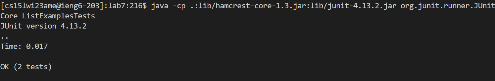

# Week 4 Lab Report (Changing a File using nano)

## Making a Fork 

First, I started the process by clicking on the lab 7 repository link in Week 7. I then
pressed `Fork` at the top right corner of the repository. 

I then pressed `Create fork` at the bottom of the page. 

## Logging onto ieng remote account

After that, I opened up Visual Studio Code in order to access my terminal and start logging
into my remote account. Because I have history of logging into my remote account, I typed out 
`history` to find the command to log onto my remote account and pressed: `<enter>`.

After that I copied `ssh cs15lwi23ame@ieng6.ucsd.edu` by highlighting the command with my cursor 
and pressing: `Ctrl` and `c` together. Then I hovered over the new line in my terminal and pressed:
`Ctrl` and `v` together. The command should appear and then I pressed: `<enter>`. We are now in the
remote account. 

## Cloning Fork of Repository 

Since we did set up the SSH key in class there was no need to put in the password. After that we want
to clone my fork of the repository from my Github account. We would go back to the Github and click on
`<> Code`. Find the `SSH` tab and clicked on the image with two pages next to the Github link. I went back 
to VS Code, typed in `git clone ` then pressed: `Ctrl` and `v` together. Then `<enter>` into the terminal. This
should clone the repository in our remote account. 

This is what should have appeared after completing all the steps to clone the fork. 

## Running JUnit Tests (that fail)

First I would have to change directory to lab7 so I typed in `cd lab7` and `<enter>` before I ran the tests. 
To run the tests, the `javac -cp .:lib/hamcrest-core-1.3.jar:lib/junit-4.13.2.jar *.java` command was 3 up in
the search history so I pressed: `<up><up><up><enter>`. If it compiled correctly, nothing should show. 

To run the tests, I would have to go 3 up in the search history so I pressed: `<up><up><up><enter>`. If
it ran correctly, it should show this:

As we can see here, there is a test we have failed so we have to fix our errors in the `ListExamples.java` file.

## Edit Code File

Now we want to edit our code file and fix our errors to pass the tests. First I typed in `nano List` and then pressed
`<tab>` for it to autocomplete to `nano ListExamples`. Since there are two ways it can autocomplete (`ListExamples.java`
and `ListExamples.class`), I just typed in `.java` at the end and then pressed `enter`. It should open up a page that 
looks like this:

  
To fix the file, I pressed: `Ctrl` and `w` together. I typed in `result.add` to find the first instance of the method and then 
pressed `<enter>`. I then pressed `<right><right><right><right><right><right><right><right><right><right><right><right><right><right>` 
14 times to get to where I want to start deleting. Then I pressed: `<backspace><backspace><backspace>` 3 times so I would be left with 
just `result.add(s)`. 
  

Since I know where the second error is I pressed: `Ctrl` and `w`, typed in `index1`, and pressed `<enter>`. Since it only shows the first
instance of `index1` I pressed: `<down><down><down><down><down><down><down><down><down><down><down><down><down><down><down><down><down>` 17 times
to find the `index1` I want to change. Then I pressed `<right><right><right><right><backspace>` to delete the `1` and typed `2`. 
  

  
These are all the errors I want to change so I pressed `Ctrl` and `o`. Then `<enter>` to save my changes. Here is what it shows after:
  

  
To exit out of nano I would press: `Ctrl` and `x`. 

## Running JUnit Tests (that pass)
  
We have ran the tests before so we would just press the up arrow to find the history of our commands. For me, I had to press: `<up><up><up><enter>`.
If it compiled correctly it shouldn't show anything. To run the tests, I pressed: `<up><up><up><enter>`. This is our results after fixing the 
`ListExamples.java` file:

## Committing and Pushing into Github

Since all the tests are now satisfied, we now want to commit and push our changes. To do that I typed in: `git add ListExamples.java` and pressed `<enter>`. 
Then I typed in `git commit -m "Updated"` and pressed `<enter>` and then show this in the terminal:

After that I want to push the changes so I put: `git push` and `<enter>`. This is what showed up:

Going back to our Github page, we see that the changes we made in Visual Studio Code are reflected in the file. 

