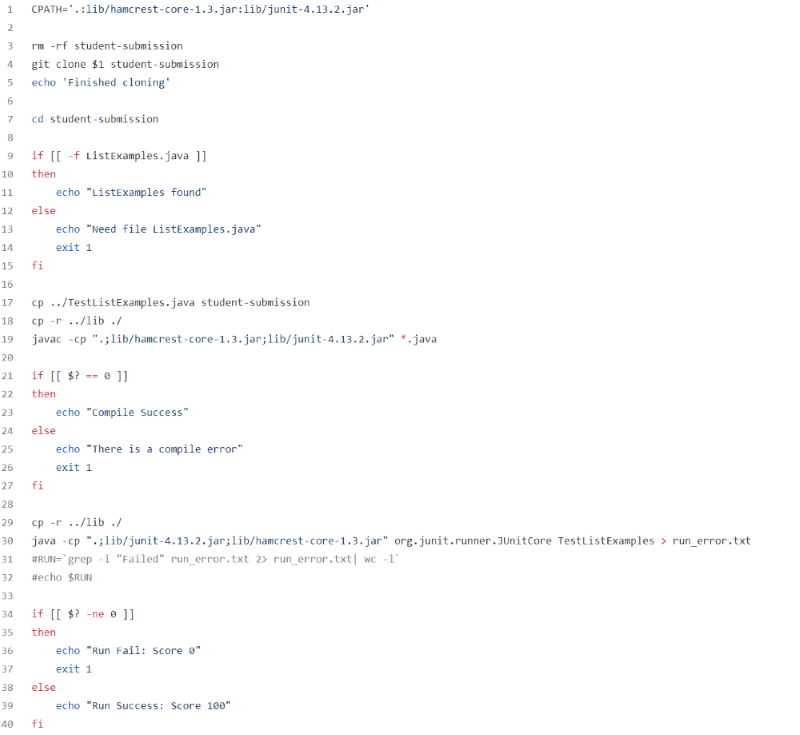
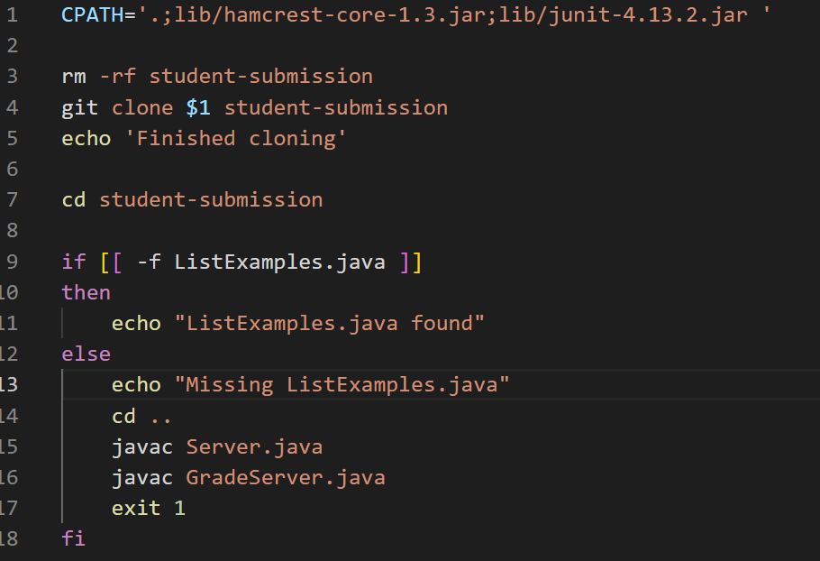
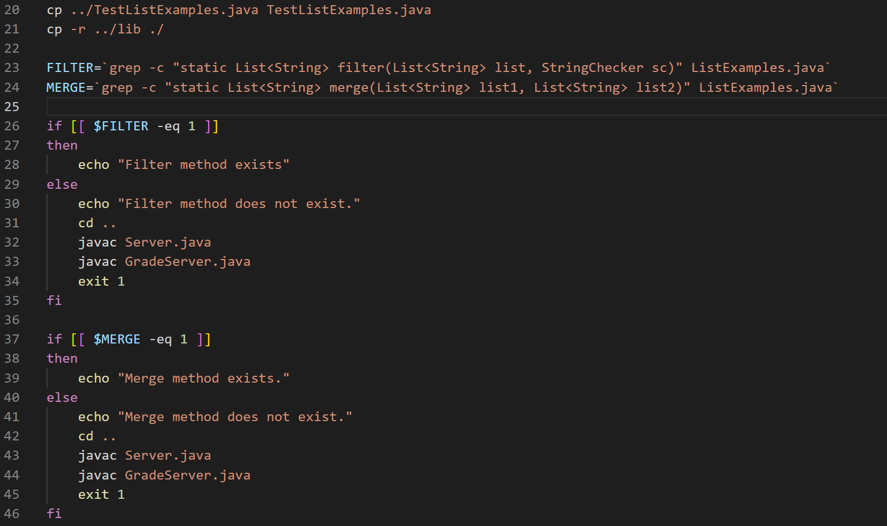
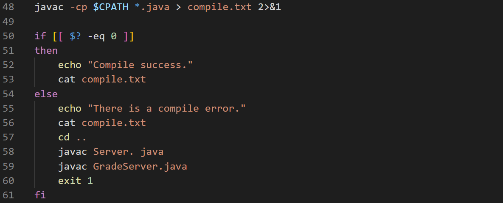
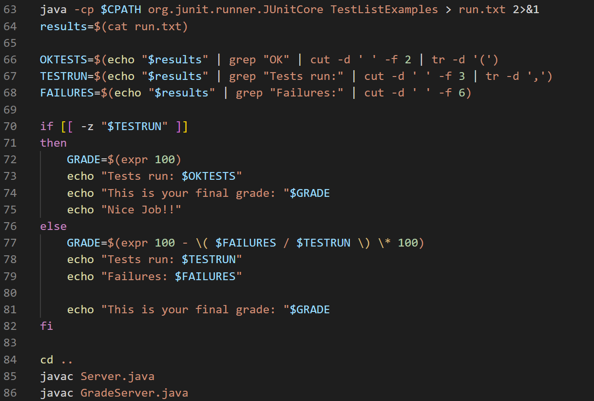
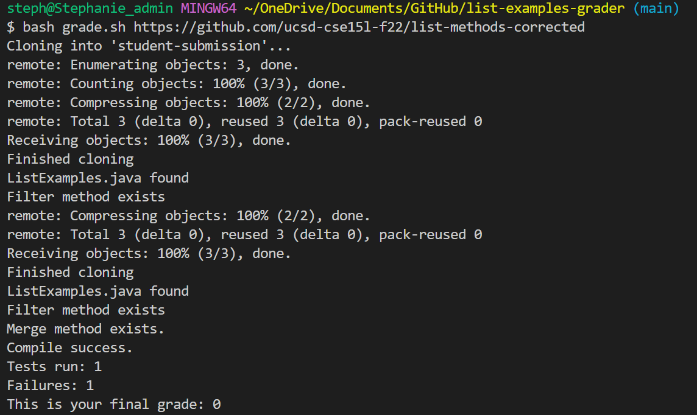
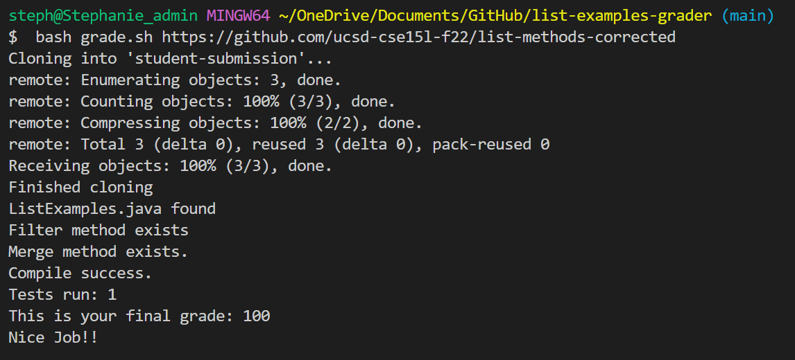
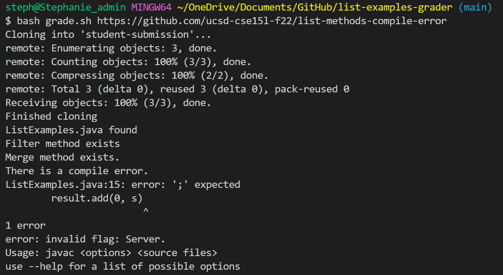
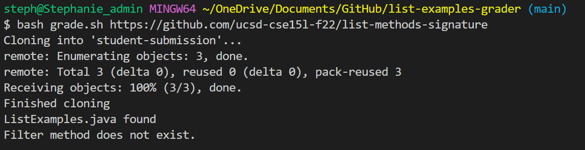

# Week 5 Lab Report (Creating a grading script)

## Making a better autograder

In this week's lab I have chosen to edit my grading script file because I
did not really understand how to make a comprehensive test. In the beginning, 
I only made it so the autograder will give a prompt for passing/failing
the compile and passing/failing the run. This was my code before the edits:



As you can see here, it is not as sophisticated as a normal autograder and the
only thing that the script is testing is if the file compiles and runs. It first
checks to see the `ListExamples.java` file exists before trying to compile. After
the compile, it will try to run and if it fails, the student gets an automatic zero.

In order to make it more sophisticated, I would like to make partial credit as an 
option. Partial credit will be given based on how many total tests there are and 
how many the student passed. Additionally, it should go into `ListExamples.java` 
to check if the specific methods exist before doing JUnit testing. 

## Editing my grade.sh file

As you can see there are many changes I have to make in order to make my autograder
more sophisticated. The first part of my code didn't need any changes as I just wanted
to find if `ListExamples.java` existed in `student-submission` directory. I would first
recursively remove other `student-submission` directories that I had before running 
my grading script. Then I would `git clone` another student submission, `cd` into 
`student-submission`, and then search for `ListExamples.java` file.



If the conditions are not satisfied, we see that it will indicate the type of error,
run the server, and then exit the grading script. If it passes however, it will go onto
the next step which is copying the tester we have into the current directory. Our tester
name is `TestListExamples.java` so we retrieve it outside of our `student-submission` directory.

After that since we want to see if our methods correctly match the expected parameters before 
doing JUnit testing, I made variables that search for expected pattern of the method headers. 
The option `-c` after `grep` command prints the count of lines that match the pattern. If it matches
in the file, we should see that there is 1 instance of the method. More specifically, it looks 
for matching method headers in the filter and merge method in `ListExamples.java`. 



As we can see, if the method exists then it would go through the code. If it finds no matches however, 
it will indicate which method cannot be found, run the server, and exit the grading script. 

After all of this, we would like to compile. There was nothing specific that I added except for showing
the compile output. The `2>&1` redirects standard error to standard output and then both to `compile.txt`.
This is useful in that it puts both the regular output and error messages in one file instead of displaying 
error messages on the screen. 



After compiling, we finally want to run our `TestListExample.java` against `ListExamples.java`. Again, 
if there are any errors we would want to compile both the regular output and error messages in one
file using `2>&1`. This is where the hard part is because we want to take specific elements from
our `run.txt` and use mathematical expressions to calculate our student's score. This is the code I 
ended up with:



Since failing and passing all tests produce different outputs, I had to make three different variables 
and match the pattern. The first varible was `OKTESTS` which tries to find a pattern that matches `OK`
and then looks for the number of tests it passed. The stuff after is `cut -d ' ' -f 2` which cut the 
output using space delimiter and looks for the second field which is what we want. `| tr -d '(')`
replaces all occurrences of `(` with nothing since the output has a `(` blocking the number. 

The second variable is looking for `Tests run:` if the file fails some of the tests. It looks for the 
number after `Tests run:` which is separated by a space so we use  `cut -d ' ' -f 3` which cuts the 
output using space delimiter and looks for the third field. We do not want the `,` after number of tests 
to appear so we remove that by putting `tr -d ','` after it. 

The third variable looks for `Failures:` since the output shows the number of failures we had. It ends 
up being in field 6 and we would not have to remove anything after because the number is the last thing in 
the line. 

In the end, it sees if there is anything in the `TESTSRUN` variable before saying that all the tests
has passed. If there is nothing (indicated by `-z` option) it will give 100% and output the number of 
tests from `OKTESTS` variable. If there is something in the variable however, it will calculate the 
score using `TESTSRUN` and `FAILURES` variable. It will then output the total tests ran, the number 
of failures, and the grade calculated from those two variables. 

## Testing the grader

First I test the grader with the repository from lab 3. This is the output:



If you recall, lab 3 should fail the test because it had a runtime error. Specifically it was referencing
`index1` which does not exist in a for loop. Since our `TestListExamples.java` only has 1 test and they
failed the test, the student gets a final grade of 0.

Moving on, testing our grader against a correct repository we should see that it passes all tests 
and gets a 100. 



Testing the grader with a repository that has compile errors should show this output:



As you can see here, it produces a compile error and the grader stops there as expected. It also shows 
the compile error output so students know what to change/what had caused a compile error. 

The last repository we'll look at is one where the filter method has parameters in the wrong 
order. Using our tester we see this output:



As you can see here, it will give an error saying that the filter is not found. Even though the filter
method exists, it tells the student that it is not the expected filter method so the student will 
recheck and make sure it is right. 

Since `TestListExamples.java` only has one tester, we would always get 100% or 0%. To test our
grader and see if it outputs the expected grade, our tester would have to contain more than 1 test. In
that way it would show more than just:

```
Tests run: 1
This is your final grade: 100
Nice Job!!
``` 

and 

```
Tests run: 1
Failures: 1
This is your final grade: 0
```
